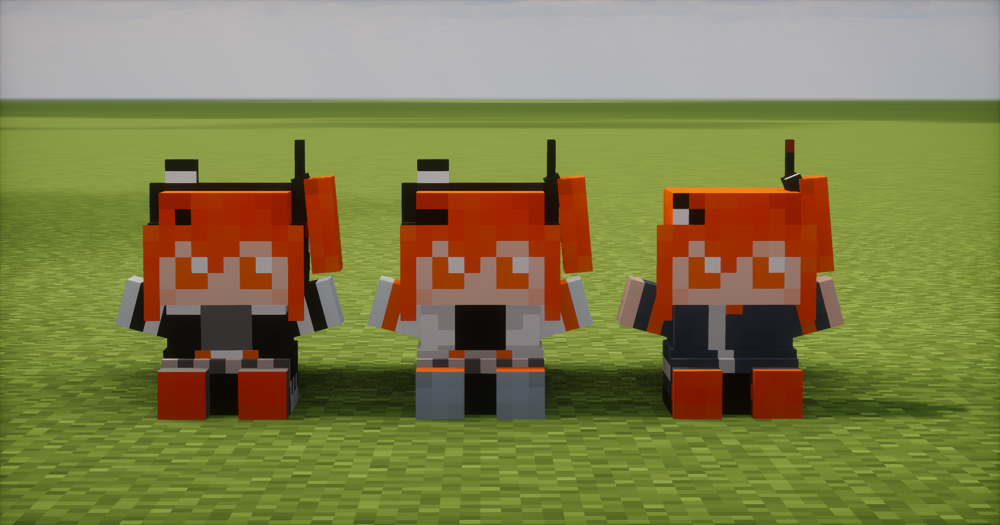

# AdachiRei-nui

### 対応環境

- ModLoader： **FabricLoader 0.16.0** 以上
- MinecraftVersion： **1.21.6~1.21.10**
- 前提Mod： **FabricAPI**

    1.21.11 でも起動しますが若干不安定なのとスプラッシュメッセージの表示が正常に出来ません。

---

- [Download Latest](https://github.com/yh2237/AdachiRei-nui/releases/latest)

---



以下のコマンドで頭の上に乗せれます

```
/item replace entity @p armor.head with adachirei-nui:adachi-nui
# 又は
/item replace entity @p armor.head with adachirei-nui:adachi-nui_new
# 又は
/item replace entity @p armor.head with adachirei-nui:adachi-nui_vocaloid
```


---

### スプラッシュメッセージについて

スプラッシュメッセージは [@adachirei0](https://x.com/adachirei0) のツイートをほぼすべて保存している [足立データベース](https://adachi.2237yh.net) のAPIからランダムに取得し表示しています。

足立データベースには2026/02/09現在、37211件のツイートが保存されています。

サーバとの通信ができない場合は通常のスプラッシュメッセージが使用されます。

---

### 全人類フォローするべき

- [@MechanicalGirl0](https://x.com/MechanicalGirl0)
- [@missile_39](https://x.com/missile_39)
- [@adachirei0](https://x.com/adachirei0)
- [@Molmax0710](https://x.com/Molmax0710)

---

### ライセンス

**[足立レイ](https://mechanicalgirl.jp/adachi-rei/)は[合同会社メカニカルガール](https://mechanicalgirl.jp/)の等身大ヒューマノイドロボットです！**

- [ソースコードのライセンス(MIT)](../LICENSE)
- [アセットのライセンス](./ASSETS_LICENSE.md)

---